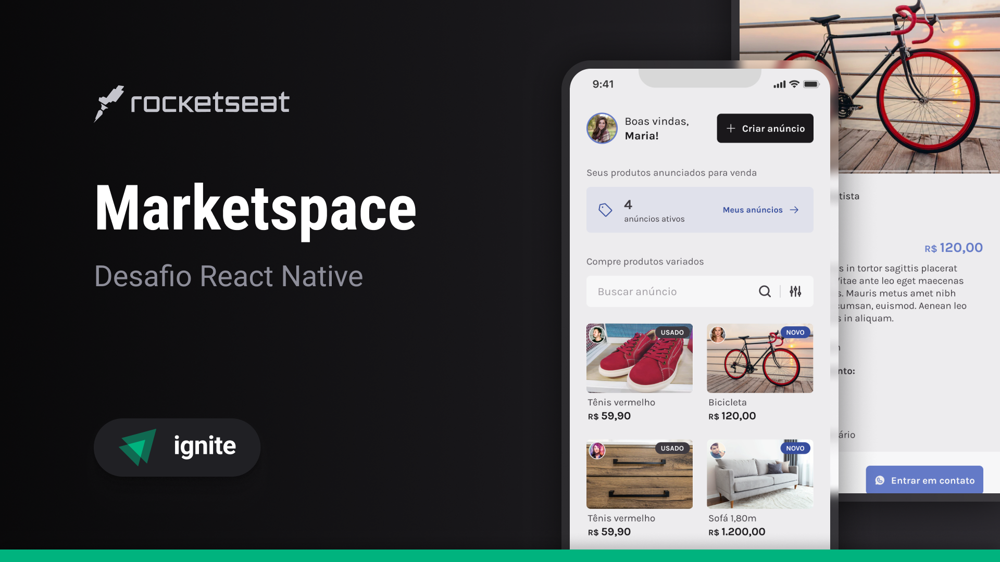

# Marketspace




O **Marketspace** é uma aplicação completa para compra e venda de produtos, composta por:

- **API (Back-end)**: gerenciamento de usuários, produtos e imagens.
- **App Mobile (Front-end)**: aplicação React Native para navegação, cadastro e visualização de anúncios.

---

## Estrutura do Projeto

```bash
marketspace/
├── api/       # API REST construída com Node.js
└── mobile/    # Aplicativo mobile com React Native
```

---

## 📱 Funcionalidades do App (mobile/)

- **Cadastro de Usuário**: Criação de conta com nome, e-mail, senha e foto.
- **Login de Usuário**: Autenticação via e-mail e senha.
- **Criação de Anúncios**: Cadastro de produtos com imagens, descrição, preço e condição (novo ou usado).
- **Visualização de Produtos**: Lista de produtos disponíveis e visualização detalhada.
- **Edição de Anúncios**: Atualização de informações dos produtos cadastrados.
- **Exclusão de Anúncios**: Remoção de anúncios ativos.
- **Filtro de Produtos**: Filtragem por condição (novo/usado).
  
---

## 🧩 Tecnologias Utilizadas

### Mobile

- **React Native**
- **Expo**
- **TypeScript**
- **React Navigation**
- **Async Storage**
- **Axios**
- **React Hook Form**
- **Yup**
- **Expo Image Picker**

### API

> A estrutura e detalhes da API estão localizados na pasta `api/`.

---

## 🚀 Como Executar o Projeto

### 1. Clonar o repositório:

```bash
git clone https://github.com/GabrielLima15/marketspace.git
```

### 2. Instalar dependências e rodar o app mobile:

```bash
cd marketspace/mobile
npm install
npx expo start
```

> Certifique-se de que a API esteja rodando localmente e que o app mobile esteja apontando para o IP correto.
